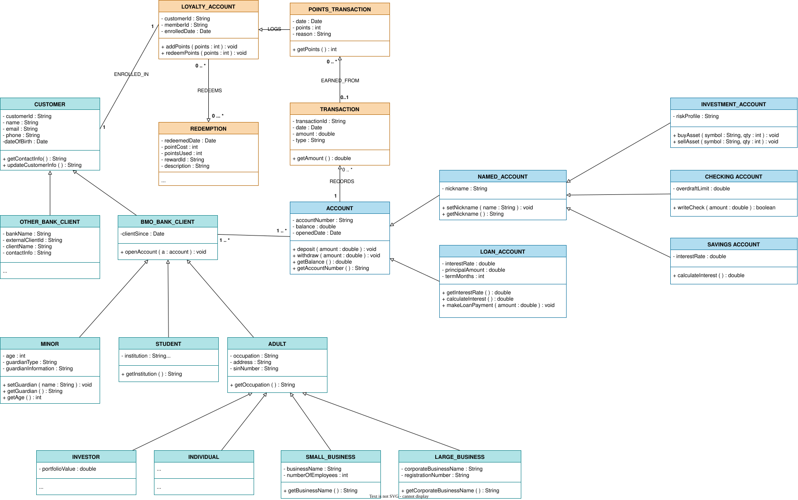

# BMO Banking: Class Diagram Project

A simple Java (NetBeans) project that turns the BMO class diagram into code. There are **20 classes** (one file each) plus a `Main.java` that creates an object of every class and calls every method.

## Class Diagram

 


## Project Structure

```
BMO/
└── src
    └── bmo/
        ├── Customer.java          ├── Account.java
        ├── OtherBankClient.java   ├── NamedAccount.java
        ├── BmoBankClient.java     ├── LoanAccount.java
        ├── Minor.java             ├── InvestmentAccount.java
        ├── Student.java           ├── SavingsAccount.java
        ├── Adult.java             ├── CheckingAccount.java
        ├── Investor.java          ├── Transaction.java
        ├── Individual.java        ├── PointsTransaction.java
        ├── SmallBusiness.java     ├── LoyaltyAccount.java
        ├── LargeBusiness.java     ├── Redemption.java
        └── ASSIGNMENT02BMOBANKSYSTEM.java (Main Class)
```

## Inheritance

```
Customer
├── OtherBankClient
└── BmoBankClient
    ├── Minor
    ├── Student
    └── Adult
        ├── Investor
        ├── Individual
        ├── SmallBusiness
        └── LargeBusiness

Account
├── NamedAccount
│   ├── InvestmentAccount
│   ├── SavingsAccount
│   └── CheckingAccount
└── LoanAccount

Standalone: Transaction, PointsTransaction, LoyaltyAccount, Redemption
```


## Constructor Reference

Every constructor lists the parent's values first, then the class's own values. All dates are plain `String`s such as `"2020-01-01"`.

| Class | Constructor parameters |
|---|---|
| `Customer` | customerId, name, email, phone, dateOfBirth |
| `OtherBankClient` | *Customer's 5* + bankName, externalClientId, clientName, contactInfo |
| `BmoBankClient` | *Customer's 5* + clientSince |
| `Minor` | *BmoBankClient's 6* + age, guardianType, guardianInformation |
| `Student` | *BmoBankClient's 6* + institution, studentId |
| `Adult` | *BmoBankClient's 6* + occupation, address, sinNumber |
| `Individual` | same as `Adult` |
| `Investor` | *Adult's 9* + portfolioValue |
| `SmallBusiness` | *Adult's 9* + businessName, numberOfEmployees |
| `LargeBusiness` | *Adult's 9* + corporateBusinessName, registrationNumber |
| `Account` | accountNumber, balance, openedDate |
| `NamedAccount` | *Account's 3* + nickname |
| `CheckingAccount` | *NamedAccount's 4* + overdraftLimit |
| `SavingsAccount` | *NamedAccount's 4* + interestRate |
| `InvestmentAccount` | *NamedAccount's 4* + riskProfile |
| `LoanAccount` | *Account's 3* + interestRate, principalAmount, termMonths |
| `Transaction` | transactionId, date, amount, type |
| `PointsTransaction` | date, points, reason |
| `LoyaltyAccount` | customerId, memberId, enrolledDate |
| `Redemption` | redeemedDate, pointCost, pointsUsed, rewardId, description |

## Methods

| Class | Methods |
|---|---|
| `Customer` | `getContactInfo()`, `updateCustomerInfo(name, email, phone)` |
| `BmoBankClient` | `openAccount(Account a)` |
| `Minor` | `setGuardian(name)`, `getGuardian()` |
| `Account` | `deposit(amount)`, `withdraw(amount)`, `getBalance()` |
| `NamedAccount` | `setNickname(name)`, `getNickname()` |
| `LoanAccount` | `getInterestRate()`, `calculateInterest()`, `makeLoanPayment(amount)` |
| `InvestmentAccount` | `buyAsset(symbol, qty)`, `sellAsset(symbol, qty)` |
| `SavingsAccount` | `calculateInterest()` |
| `CheckingAccount` | `writeCheck(amount)` (returns `true`/`false`) |
| `LoyaltyAccount` | `addPoints(points)`, `redeemPoints(points)` |

A few classes also have a one-line getter (for example `getInstitution()` in `Student`) so that `Main` can print their values.
